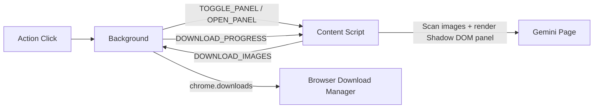

# banana-downloader Development Guide

## 1. Current Architecture



Notes:

- The extension no longer uses a popup page. UI is fully rendered inside the content script.
- Extension icon click is handled by background, which decides whether to toggle the panel or open Gemini first.

## 2. Core Modules

### 2.1 `src/background/index.ts`

- Listens to `chrome.action.onClicked`
- Sends `TOGGLE_PANEL` for Gemini tabs
- Opens a new Gemini tab (if needed) and sends `OPEN_PANEL` after load
- Receives `DOWNLOAD_IMAGES` and runs batch download
- Broadcasts `DOWNLOAD_PROGRESS`

### 2.2 `src/content/index.ts`

- Scans page images and detects Gemini-generated images
- Builds/updates panel via `ShadowRoot`
- Manages panel state: `idle/loading/ready/error/downloading/done`
- Handles select all / unselect all, filename prefix input, and download trigger

### 2.3 `src/types.ts`

- Defines shared image and message types

## 3. Image Detection and URL Handling

### 3.1 Image Detection Strategy (multi-signal)

- Container signal: `button.image-button`, `.overlay-container`
- URL path signal: `/gg-dl/` or `/aip-dl/`
- Nearby button signal: labels like “Download full size image”
- Visual size filter to avoid small/noisy images

### 3.2 Full-Size URL Rule

- Detects Google image suffix parameters (for example `=s1024-rj`)
- Rewrites to `=s0` for full-resolution download

## 4. Local Development Workflow

```bash
pnpm install
pnpm dev
```

Load extension in Chrome:

1. Open `chrome://extensions`
2. Enable Developer mode
3. Click “Load unpacked”
4. Select `dist/`

Build command:

```bash
pnpm build
```

## 5. Debugging Guide

### 5.1 Panel does not appear

- Confirm current page is `https://gemini.google.com/*`
- Refresh the page and try again
- Check Service Worker logs for `sendPanelMessage failed`

### 5.2 No images detected

- Open Gemini page console and inspect scan logs:
  - `[banana-downloader] Scanned X , matched Y Gemini images`
- Scroll the page to trigger lazy loading, then retry

### 5.3 Download failures

- Check login status
- Check extension Errors panel and Background logs

## 6. Constraints and Conventions

- Use `pnpm`
- Keep Manifest V3 compatibility
- Keep panel visual style dark and aligned with Gemini
- Add new behaviors through explicit message types, avoid implicit string protocols
