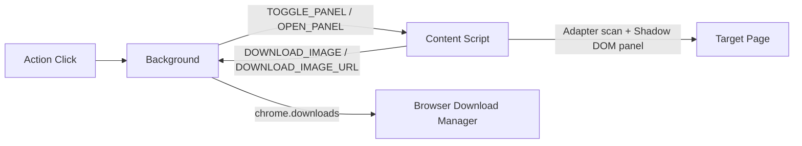

# banana-downloader Development Guide

## 1. Current Architecture



Notes:

- No popup page. UI is rendered in content script shadow DOM.
- Background decides whether to toggle panel on supported tab or open a default tab.
- Supported hosts: `gemini.google.com`, `notebooklm.google.com`.

## 2. Core Modules

### 2.1 `src/background/index.ts`

- Handles action click
- Sends `TOGGLE_PANEL` / `OPEN_PANEL`
- Handles:
  - `DOWNLOAD_IMAGE` (dataUrl)
  - `DOWNLOAD_IMAGE_URL` (imageUrl + watermarkMode)
  - `SUPPRESS_DOWNLOADS`
- Applies per-mode watermark cleanup before save (`gemini` / `notebooklm` / `none`)
- Suppresses duplicate native `blob:` downloads during Gemini batch flow

### 2.2 `src/content/index.ts`

- Shared in-page panel and state management
- Host-based adapter selection and orchestration
- Common download loop and progress updates
- Runtime message timeout protection for background calls

### 2.3 `src/content/adapters/*`

- `index.ts`: host -> adapter route
- `types.ts`: adapter interfaces
- `viewport.ts`: lazy-load preloading helpers
- `gemini.ts`: Gemini-specific detection/download logic
- `notebooklm.ts`: NotebookLM infographic detection/download logic

### 2.4 `public/download-interceptor.js`

- Main-world fetch patch for Gemini download chain
- Uses `captureId` mapping (`GBD_CAPTURE_EXPECT` / `GBD_CAPTURE_CANCEL`)
- Posts `GBD_IMAGE_CAPTURED` back to content script

## 3. Site Flows

### 3.1 Gemini

1. Scan generated images from conversation DOM
2. User selects images in panel
3. For each image: find native download button and click
4. Interceptor captures final image response (`image/*`) and posts data URL with `captureId`
5. Content script sends `DOWNLOAD_IMAGE` to background
6. Background removes watermark and saves file

### 3.2 NotebookLM (Infographic)

1. Scan `artifact-button-content` entries and keep infographic items
2. For each selected item: open artifact viewer
3. Read viewer image URL (`/notebooklm/` or `/rd-notebooklm/`)
4. Send `DOWNLOAD_IMAGE_URL` to background
5. Background runs NotebookLM local-difference mask cleanup, with full-region column-fill fallback, then saves file

## 4. Reliability Strategy

- Preload lazy content before scanning/downloading
- Retry with scroll-container sweep when target element is missing
- Use `captureId` to avoid timeout-related blob mismatch
- Add runtime message timeout guards to avoid stuck batch loops

## 5. Local Development Workflow

```bash
pnpm install
pnpm dev
pnpm build
```

Load extension in Chrome:

1. Open `chrome://extensions`
2. Enable Developer mode
3. Click "Load unpacked"
4. Select `dist/`

## 6. Debugging Guide

### 6.1 Panel does not appear

- Confirm page host is supported
- Refresh the page and retry
- Check service worker logs for `sendPanelMessage failed`

### 6.2 No items detected

- Scroll page manually once, then reopen panel
- Check content-script logs for adapter scan results

### 6.3 Download failures

- Check extension Errors panel and background logs
- Verify login/session state on target site
- Retry after refresh to reset page/runtime state

## 7. Constraints and Conventions

- Use `pnpm`
- Keep Manifest V3 compatibility
- Keep panel dark theme and consistent with target site UI
- Add new behavior through explicit message types
